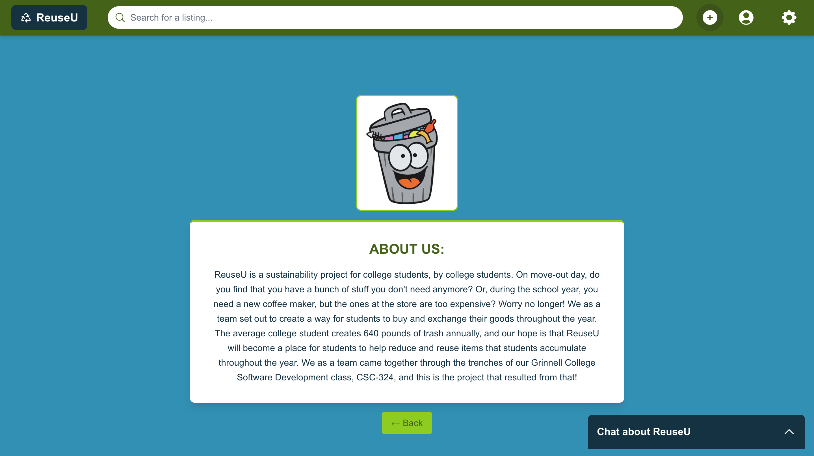

# Sprint 5 Journal 

## (1) Adoption Plan (Preamble)
*Date written: 4/29/2025*

#### Is ReuseU ready for adoption?

- As of now, our product has a lot of performance issues that are not ideal for user deployment. As of our last demo `(demo 2)`, ReuseU takes around 30 seconds to load images (and the rest of the listings as a result). This is because we had to cut some corners since we are underfunded. The website as of now works somewhat locally, but we have yet to deploy it fully to a public server. So we will continue to keep developing our product for now. If we deploy ReuseU, it will most likely be is everything falls into place at the end. 
  - RISKS/BENEFITS:
    1. **Load Times** (Risk): Our product takes a long time to load when it comes to industry-standard runtimes. 
    2. **Base 64 Compression Use** (Risk): Base 64 as a practice will be always be a slower option for compression purposes. It adds more work on our servers.
    3. **Chats do not update in realtime** (Risk): This is something that is still in development, and as of now our chats function on the frontend does not work at all. It is only implemented on the backend however. 
    4. **ReuseU is not connected to the internet** (Risk): Right now, our Vercel deployment tests are mostly failing. We will need to have this fixed before we can deploy our site. 
    5. **This site would be dropping right when Grinnell needs it** (Benefit): If we get this website into its final version on time, then it could be used for move-out day (it's intended purpose) this year. It would be a fantastically quick turnaround. 

3: Continued development plan (if not ready for adoption)

  - *Will your product be ready for adoption after some future work? Why or why not?* 
    - Yes! Our product is on the cusp, for the lack of a better word. There a lot of things that are working well, like our listings functionality, but the performance issues are something that we would mainly have to tackle before we would be comfortable deploying it. We would also need to fix our chats functionality (make it work on the frontend and not just on the backend). 

### (1) Adoption Plan (Epilogue)

*Date written: 5/12/2025*

*What we did to carry out our plan, and the outcomes:* 

#### How we implemented our plan:
- All of the issues that I addressed above have been resolved. We are much closer to deployment now, and all we need to do now is make sure that images work now on our [working website url](https://reuse-u-ruddy.vercel.app/). We addressed one risk at a time, talking out each one as we went. We are very close to deployment now, and plan to have it completed after the semester is over to have a complete project for our coding portfolios.

## (3) Bug Logging
FOR COMPLETING THIS PART, SOFIA PUT THE INSTRUCTIONS IN [THIS ISSUE](https://github.com/dicarlosofia/ReuseU/issues/155)

<!--- (ADD LINKS BELOW) -->

* [BUG 1: Profile Page Not Loading](https://github.com/dicarlosofia/ReuseU/issues/163)
* [BUG 2: Delete_message function serves its purpose, but still returns an error](https://github.com/dicarlosofia/ReuseU/issues/166)
* [BUG 3: No Reset Password](https://github.com/dicarlosofia/ReuseU/issues/162) 

## (4) License
We have chosen the following license: **GNU General Public License v3.0**
* Navigation to it in our Repo: `ReuseU/LICENSE`

## (5) Wrap-up work
<!---
Make your repository presentable to future audiences.

Potential future audiences may include:

 - future 324 students looking for inspiration for their project proposals
 - prospective employers looking at your github
 - prospective users looking to get started with your product

Consider the following tasks to make it presentable

 - code cleanup
 - final documentation

Add a section to your Sprint Journal describing what you did.

--->
* **Sofia**: I commented my code before I submitted it for review with my teammates, so I went through and refined the README.md file to have better navigation.
* **Timur**: 
* **Howie**: I overhauled frontend, enhanced new components on Chats, Profile, and Listings, fixed authentication bugs and implemented filtering and WebSocket chats
* **Trung**: I am tasked with deploying the website on Vercel and worked with Krishna on automated deployment. 
* **Peter**: 
* **Krishna**: Finished off automated testing, then finalized visual/artistic choices such as logo, mascot and icon.

## (7) Blog Post
<!--- PASTE THE BLOG POST BELOW: --->
# ReuseU - Blog Post

### [Link to our repository](https://github.com/dicarlosofia/ReuseU)

### Our Team:
* Howie Youngdahl
* Sofia DiCarlo
* Peter Murphy
* Timur Kasimov
* Trung Le
* Krishna Nayar

### Categories:
- 2025 Spring
- Colleges
- Web Application
- For Sale
- Marketplace
- Students
- Reduce, Reuse, Recycle
- Environmental Impact

### Overview

ReuseU is a sustainability project for college students, by college students. It’s a web application designed for college campuses that lets students trade their used items with each other to help reduce their environmental impact, as well as save good bucks by buying used. It also offers great convenience as users  can easily find a variety of items on their campus from their fellow students without the need to visit stores that can be miles away. Students can easily access the website both on their desktop and mobile devices, post listings of what they wish to sell, as browse through items that other users are selling. You can think of ReuseU as the “For Sale” section of Craigslist, but localized to college campuses.

### Motivation

On move-out day, do you find that you have a bunch of stuff you don't need anymore? Or, during the school year, you need a new coffee maker, but the ones at the store are too expensive? Worry no longer! This is what inspired us as a team to create a way for students to buy and exchange their goods throughout the year. The average college student creates 640 pounds of trash annually, and our hope is that ReuseU will become a place for students to help reduce and reuse items that students accumulate throughout the year. We as a team came together through the trenches of our Grinnell College Software Development class, CSC-324, and this is the project that resulted from that!

### Product

As described above, our product is a web application where users sell and purchase used items with other college students. Read on to get a better idea of all the features our website offers:
* Each user has an account on the website that they can create with their institution’s email (.edu email). They can personalize their profile page by uploading a profile picture or writing a few words about themselves, as well as changing their preferred name and pronouns. 
* Users can create listings about items they would like to sell, as well as see their active listings and delete the ones that are no longer active. When creating a listing, they can include the item’s title and description, a price, tags, and photos of the product. We have an OpenAI feature that suggests prices for items that users are trying to sell.
* Users can also search for items they’re interested in by simply browsing through the homepage, using the search bar, or using filters. Filters let users organize items by price, categories, or favorited listings. Users can expand a listing by clicking on it to read a full description, scrolls through additional photos, and see seller’s info as well as message the seller about purchasing an item.
* Chats are implemented and can be used to further inquire sellers about items, or set up a meeting a check out the items in question. 
* There is also an About Us page, where users can read on more about the project and the motivation behind.

### Process

- At the beginning of the semester, for our team communication, we established a group chat on Microsoft Teams. As the semester went on, we found that response times were longer than we had originally anticipated. To solve this, we decided as a team to sit down and find a better solution to get better response times, and with open communication and workshopping a few ideas, we found that an iMessage group chat worked the best for us. Not all of us could access Teams directly from our phones, so having direct text messages was the best way to reach most of us the quickest.

- After having initial version of both the frontend and backend, a challenge we faced was connecting the two components together. This required quite a bit of learning and set up with API routes, CORS, and page hierarchy to allow routing to happen. Another issue of the similar format we faced was ensuring  that the creation of an account through Firebase Authentication on the frontend correctly triggered the account creation in the database, which required both the frontend and the backend running in the testing/development processes. Lastly, deploying the working version of the website to Vercel also took a lot of manipulation and some last minute functionality changes, for instance because Vercel had limitations on the size of the project it could involve and the large size of one of the computer vision libraries we used for image compression made it impossible to deploy through Vercel. As such, we had to quickly find a smaller and more focused library that allowed the same image compression functionality while also fitting within the size limits required by Vercel. In general, making sure all the different components and technologies of our website came together and worked in unison proved to be a much harder task than we initially anticipated it to be.

### Advice [Optional]
* Research your technologies early and make sure they are compatible with each other.
* Follow the paper prototype specification when developing your website, use that previously done work instead of designing everything from scratch.

### Acknowledgments

We would like to thank our Professor Leah Perlmutter for her instruction, guidance, and feedback throughout our work on this project. We would also like to thank Destany Best, our course mentor, for her continuous feedback, encouragement and support. A shout out to all of our classmates for providing feedback and asking insightful questions during our presentations, and finally we want to say thank you to our stakeholder testers, Melina, Cam, and Mason, for testing out multiple versions of our website and providing Insightful feedback.

###	Pictures of your choice (at least 3)

